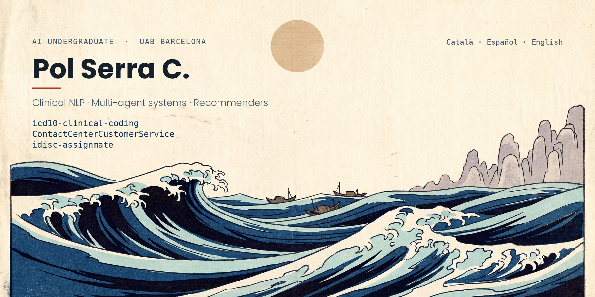

### What I have been building

**[icd10-clinical-coding](https://github.com/pscxgpt/icd10-clinical-coding)** — Spanish clinical
literals to ICD-10 categories. A domain-pretrained RoBERTa with learned attention pooling, +4.9
macro-F1 over a TF-IDF baseline across 13,700 hospital records. The interesting part is not the
score but why the model rarely agrees with the human coder, and when that is the right outcome.

**[ContactCenterCustomerService](https://github.com/pscxgpt/ContactCenterCustomerService)** — a
retail-banking contact centre rebuilt as a multi-agent system, for the AI Mavericks challenge at
Accenture Barcelona. The router escalates by confidence rather than by default: keyword rules
settle the obvious turns at zero cost, a local embedding classifier takes the rest, and the LLM
arbitrates only what is genuinely ambiguous. Figures a customer acts on come from deterministic
Python, never from the model.

**[idisc-assignmate](https://github.com/pscxgpt/idisc-assignmate)** — a two-tower recommender that
proposes the five best translators for an incoming job and shows the project manager the
constraint behind each one. It deliberately does not assign anything; a PM carries context the
data does not have. Built on a brief from iDISC with a team of six.

**[Muscle-Heatmap-Tracker](https://github.com/pscxgpt/Muscle-Heatmap-Tracker)** — an Android
workout tracker that paints a muscle heat map from your logged volume, so one glance shows what
you have been avoiding. Runs entirely on the phone: local SQLite, cardio read from Health Connect,
no network calls anywhere in the app.

### Also here

[Audio-download-app](https://github.com/pscxgpt/Audio-download-app) — a single-purpose Android
utility. · [pol-skills](https://github.com/pscxgpt/pol-skills) — the tooling I use day to day.

### Reach me

[pol.sercas@gmail.com](mailto:pol.sercas@gmail.com) ·
[linkedin.com/in/pol-serra-casassas](https://www.linkedin.com/in/pol-serra-casassas)
